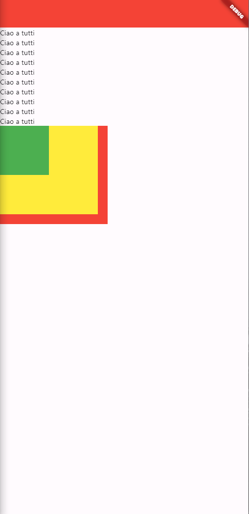
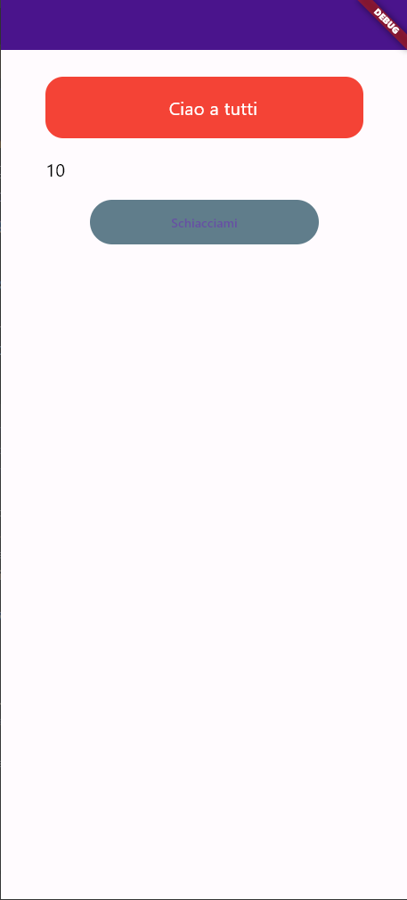

# Prima Lezione

La prima lezione di Flutter che introduce ai concetti di
Statefull, Stateless Widget e le basi per creare la prima applicazione
## Prima Lezione: Stateless e Statefull Widget e la prima Applicazione

Un Widget Statefull è un Widget che ha uno stato interno che può essere
modificato mediante le interazione dell'utente con la nostra
applicazione. \
\
Uno Stateless Widget è invece un Widget che non ha uno stato interno e si presta
molto bene per le componenti statiche della nostra applicazione, poiché non viene
modificato il proprio stato dalle interazione dell'utente. \
Per inizializzarne uno si usa la seguente sintassi:
```dart
class MyWidget extends StatelessWidget{
  const MyWidget({super.key});

  @override
  Widget build(BuildContext context) {
    return Widget; //Potrebbe essere ad esempio uno
    //scaffold o un Container
  }
}
```
Osserviamo ora il codice pesente nel [main.dart](lib\main.dart) e in [first_lesson](lib\pages\first_lesson.dart) pezzo per pezzo.
```dart
import 'package:flutter/material.dart';

void main() {
  runApp(App());
}
```
Come prima cosa importiamo la libreria material.dart che è essenziale se vogliamo scrivere
un'applicazione in flutter. \
Dichiairamo quindi il main, che è il punto di entrata del nostro codice: al suo interno
richiamiamo un'altra funzione che ci permette di avviare l'effettiva applicazione, che non
è altro che un Widget(In Flutter, di fatto, si fa prima a identificare cosa non sia un Widget
che il contrario).
```dart
class App extends StatelessWidget{
  const App({super.key});

  @override
  Widget build(BuildContext context) {
    return MaterialApp(
      home: HomePage(),
    );
  }
}
```
Questa è invece la nostra applicazione effettiva, rappresentata da un widget Stateless. In questa classe andiamo quindi a
creare un altro Widget build che andiamo a sovrascrivere da quello che si trova nella classe StatelessWidget,
ritornando una MaterialApp con come Home un altro Widget, che questa volta corrisponde a una pagina della nostra applicazione.
```dart
class HomePage extends StatelessWidget{
  const HomePage({super.key});

  @override
  Widget build(BuildContext context) {
    return Scaffold(
      appBar: AppBar(
        backgroundColor: Colors.red,
      ),
      body: ListView(
        children:[
          //Per ridimensionare qualcosa, usare sizedBox
          //Per mettere padding esiste Padding
          //Container ci permette di avere più caratteristiche
          for(int i = 0; i < 10; i++)
            const Padding(
              padding: EdgeInsets.only(right: 20.0),
              child: Text("Ciao a tutti"),
            ),
          //Sovappone i widget in profondità
          Stack(
            children: [
              Container(
                color: Colors.red,
                height: 200,
                width: 220,
              ),
              Container(
                color: Colors.yellow,
                height: 180,
                width: 200,
              ),
              Container(
                color: Colors.green,
                height: 100,
                width: 100,
              ),
            ],
          )
        ]
      ),
    );
  }

}
```
Andiamo infine a scrivere la nostra pagina effettiva. Il Widget build, invece che ritornare una MaterialApp, questa volta ritorna una Scaffold,
ovvero un Widget che ci permette di avere già una prima impostazione della pagina: ci permette di distinguere componenti come AppBar, Body, BottomNavBar
e altri ancora. Il codice scritto, se eseguito, dà vita a questa pagina:



Al suo interno viene quindi creata un'AppBar definendo il suo colore di sfondo come rosso. Per le colorazione flutter sfrutta la classe Colors. \
Come body invece andiamo a definire una ListView: questo è un Widget che ci permette di avere una vista scrollabile nell'applicazione. Attenzione però:
nulla ci impedisce di avere altri Widget al posto di ListView. Potremmo avere un Widget Container, che non è altro che un Box, un Widget Column, che ci permette
di posizionare i Widget figli come si fa con la ListView con l'unica limitazione che se i Widget vanno oltre alle dimensioni del genitore, si genere un errore di Overflow
e non ci dà la possibilità di una vista scrollabile.\
Dentro la lista dei testi in maniera dinamica grazie a un for: generiamo quindi 10 testi. Il Widget testo è però avvolto da Padding, un altro widget che ci permette di avere,
come ci suggerisce il nome, un padding. Infatti specifichiamo un padding solo a destra di 20. \
\
Andiamo infine a definire uno Stack, che non è altro che un Widget che ci permette di impilare i widget figli in profondità, come possiamo vedere dall'immagine dell'applicazione.
Infatti sullo sfondo abbiamo il container rosso, poi quello giallo e infine quello verde, uno sopra l'altro. 

### Seconda Lezione: Esplorazione dei primi Widget
Nella scorsa lezione si è visto come definire un Widget Stateless, ma non uno Stateful: vediamo ora come fare
```dart
import 'package:flutter/material.dart';


class SecondLessonPage extends StatefulWidget{
  const SecondLessonPage({super.key});

  @override
  State<StatefulWidget> createState() => SecondLessonPageState();
}

class SecondLessonPageState extends State<SecondLessonPage>
{
  @override
  int testo = 0; //Contatore utile per quello che vedremo successivamente
  Widget build(BuildContext context) {}
}
```
Come vediamo, per un Widget Stateful usiamo due classi: una per permetterci di definire l'effettivo Widget, che in questo caso viene rappresentato dalla pagina effettiva,
e una per definire lo stato del Widget. La prima classe, oltre al costruttore, non fa altro che sovrascrivere una funzione della classe StatefulWidget per creare uno stato:
lo fa facendogli ritornare lo stato del Widget, che non è altro che la seconda classe che andiamo a scrivere.

Tornando ora a Widget dateci da Flutter, parliamo più approfonditamente dei Container. Come visto in precedenza, un Container può assolvere ai compiti di più Widget che hanno 
invece scopi specifici e sono poco flessibili in questo senso.
```dart
//Imporre delle dimensioni precise: SizedBox
//Imporre un'allineamento nella pagina: Alignment
//Vogliamo dare un Padding: Padding
Container(
  margin: const EdgeInsets.only(top: 30, right: 50, left: 50),
  //alignment: Alignment.center,
  padding: const EdgeInsets.only(top: 20, bottom: 20, left: 20),
  decoration: BoxDecoration(
    color: Colors.red,
    borderRadius: BorderRadius.circular(20),
  ),
  child: const Text(
    "Ciao a tutti",
    textAlign: TextAlign.center, //Al posto di 
    //alignment nel container
    style: TextStyle(
      color: Colors.white,
      fontSize: 20,
    ),
  ),
)
```

In questo caso vediamo come il Widget Container possa assolvere ai compiti di Padding, oltre a permetterci di inserire un margine e un BoxDecoration, 
che ci permette di modificare lo stile del nostro box: nello specifico andiamo a modificare il colore e il border radius del Container.

```dart
Padding(
  padding: const EdgeInsets.symmetric(vertical: 20, horizontal: 50),
  child: Text(
    "$testo",
    style: const TextStyle(
        color: Colors.black,
        fontSize: 20
    ),
  ),
)
```
Differente è invece l'utilizzo del Widget Padding: questo ci permette di utilizzare solo l'attributo padding, senza altre possibilità come quella di 
creare un margine attorno.
Inoltre in questo codice andiamo ad inserire un testo cui valore è una variabile di tipo intero che parte da 0 interpolata all'interno di una stringa
come possiamo vedere nel codice sopra. Questo ci permette di modifica, successivamente, quello che contiene la variabile e quindi, aggiornando l'interfaccia
correttamente, ci permette di aggiornare il testo.
```dart
TextButton(
    //Scrittura contratta
    onPressed: (){
     setState(() {
       testo++;
     });
    },
     style: const ButtonStyle(
       backgroundColor: MaterialStatePropertyAll(Colors.blueGrey),
     ),
    child: Text("Schiacciami")
),
```
Vediamo ora il primo Widget Statefull offerto direttamente da Flutter e non creato da noi manualmente: si tratta del TextButton, che non è altro se non, come ci
suggerisce il nome, che un bottone con all'interno un testo. Quando scriviamo onPressed. potremmo anche successivamente andare a richiamare un metodo esterno scritto
appostiamente allo scopo di rispondere a questo evento, ma a meno ché non sia un metodo che possa essere utilizzato in diverse parti del codice, possiamo utilizzare una forma
contratta come quella che vediamo sopra e scriverci dentro come un normalissimo metodo. \
E' interessante osservare poi che al suo interno utiliziamo un altro metodo che si chiama setState, al cui interno andiamo a incrementare il contatore scritto inizialmente. Quel setState
specifica a Flutter che deve aggiornare la parte d'interfaccia che fa riferimento in qualsiasi modo a testo(In questo caso il Text avvolto dal Widget Padding che abbiamo visto prima).
Quindi, alla pressione del bottone, viene incrementato il contatore testo e viene aggiornata l'interfaccia, permettendoci di creare un clickCounter simile al codice iniziale fornitoci da Flutter
quando creiamo un nuovo progetto.

Ecco il risultato finale della nostra pagina di oggi:
 
